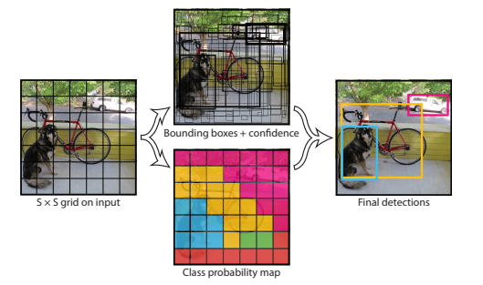
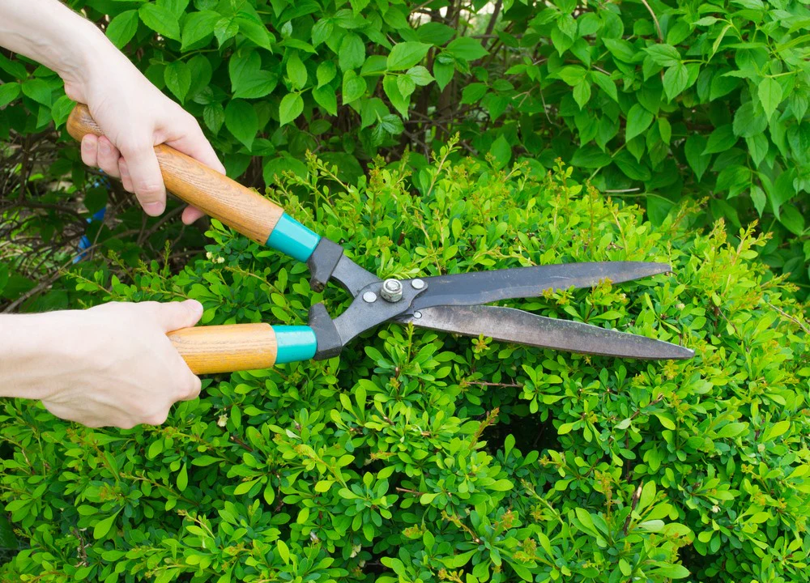

# Paper Replication from Scratch using PyTorch

This repository contains listing of paper replicationsof  different classification and object detection from scratch using PyTorch. Below, you’ll find a list of all the networks I have implemented, along with links to each respective repository.

Each implementation contains model definitions, custom loss functions, training and evaluation scripts, and visualizations. 

---
## Classification Models

### VGG16

VGG16 introduced the concept of using smaller, repeated convolutional layers with very small (3x3) receptive fields instead of larger ones, demonstrating that deeper networks with smaller filters can be more effective.

---
## Object Detection Models

### YOLOv2

YOLOv2 improved upon its predecessor by introducing anchor boxes and multi-scale training while maintaining real-time performance. 

My replication of the network and loss functions provided valuable insights into several implementation aspects, including efficient tensor operations, loss calculation, data encoding (ground truth encoding), and dataloader preparation. While the results didn't fully match the paper's performance, the implementation process was highly educational.

### YOLOv4

YOLOv4 represents a significant advancement in object detection, introducing numerous architectural innovations such as the CSPDarknet53 backbone and various "bag of freebies" training methods. 

Although I couldn't replicate every feature, my implementation achieved strong results on the PASCAL VOC dataset.

### YOLOv4-Tiny

A lightweight variant of YOLOv4 designed specifically for edge devices and mobile applications. I replicated and trained the network on the WIDER face dataset, achieving good performance.

### YOLOv6-Small

YOLOv6-Small introduces a hardware-friendly design that achieves an excellent speed-accuracy trade-off. The model employs a RepVGG-style backbone and decoupled head design, making it particularly effective for industrial applications requiring real-time performance. 

While this implementation presented significant challenges, I focused on incorporating the key architectural elements from the paper. The final results were promising, though not all features could be fully replicated.

--- 

## Model Pruning

The pruning implementations utilize `torch-pruning` and are built upon the official implementations of each repository. Each pruning repository includes detailed instructions for customizing the pruning process according to your requirements.

### Channel-Pruning-EfficientNetV2

I pruned 88% of channels of efficientNetV2 using LAMP pruning resulting 14x sammler model, 2.5x faster in inference, 14x fewer parameters & 2.5x fewer MACops. The loss on accuracy was somewhat 2% only.

After that I replaced all the SiLU and sigmoid layers with Hard Swish and Hardsigmoid as the model is to be deployed in FPGA.

### YOLOv5 Pruning

This implementation explores structured pruning techniques for YOLOv5, with modifications to the training script to incorporate pruning.

### YOLOv6 Pruning

The pruning was implemented on top of the official codebase with necessary script modifications. Detailed information is available in the repository.

### YOLOv7 Pruning

Similar to other pruning implementations, this version includes modifications to the training script to support iterative pruning.

---

## Contact
For questions, suggestions, or collaboration opportunities, please contact me at `amitrajpant7@gmail.com`
